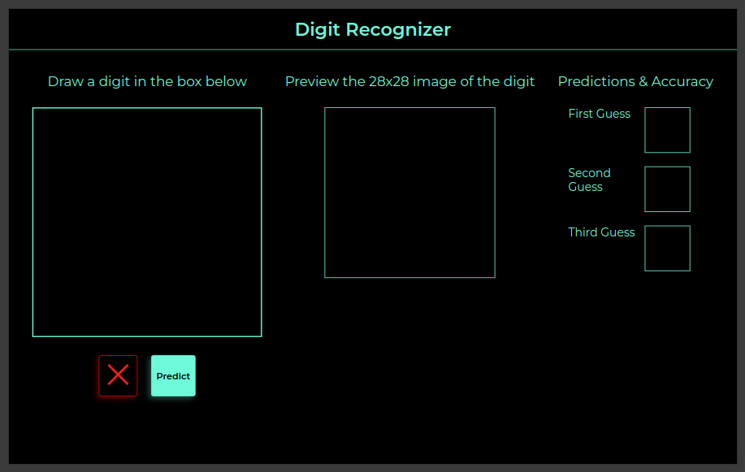
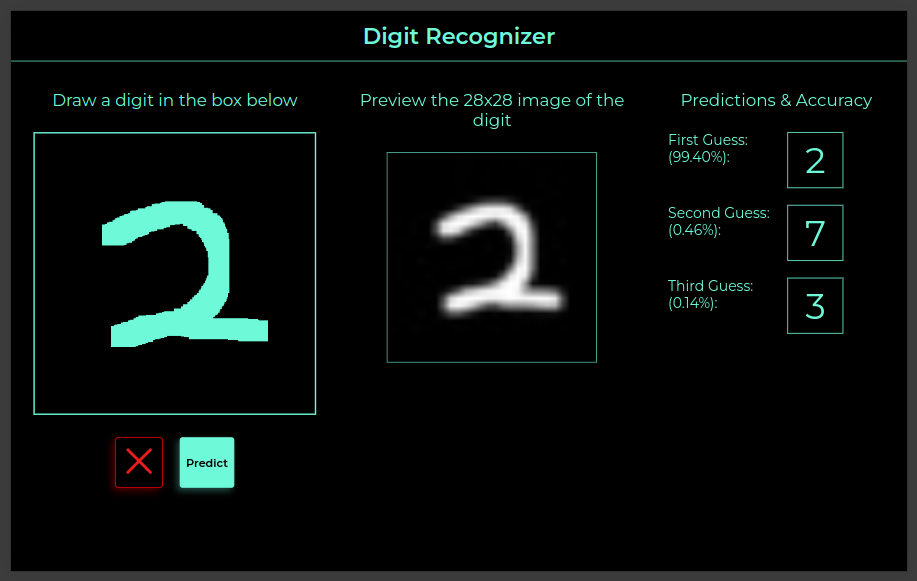
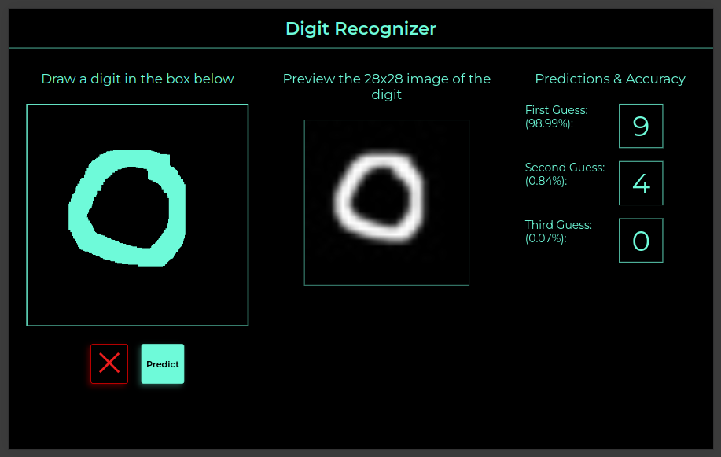

# Digit Recognizer

A dynamic digit recognizer app in progress, enabling users to handwrite on a canvas element. The drawn images are sent to the backend, processed with OpenCV, and predicted using an Artificial Neural Network (ANN). Built with Flask (Python)

## Features:

- User-friendly canvas interface
- Backend processing with OpenCV
- ANN for digit recognition
- Flask web app
- Active development

To run app: `export FLASK_APP=app.py && export FLASK_DEBUG=1 && flask run`

