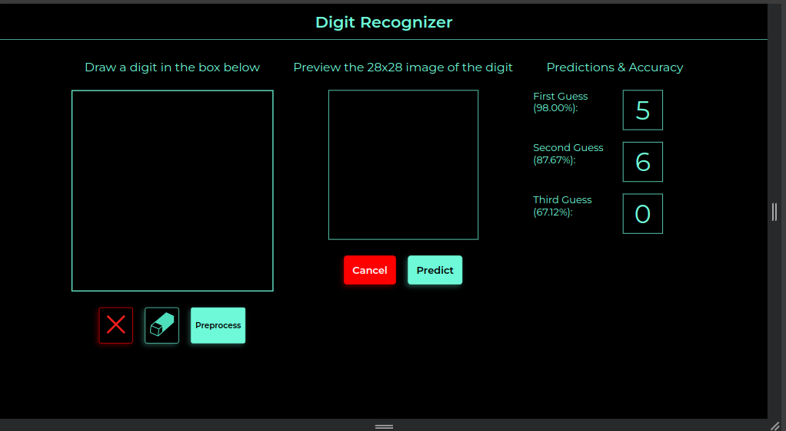

# Digit Recognizer

A web-based digit recognition application that allows users to draw digits on a canvas and get real-time predictions using an Artificial Neural Network (ANN) trained on the MNIST dataset.

## 🎯 Features

- **Interactive Canvas**: Draw digits directly in the browser using a user-friendly canvas interface
- **Real-time Prediction**: Get instant digit predictions as you draw
- **Image Processing**: Automatic image preprocessing using OpenCV (grayscale conversion, thresholding, resizing)
- **Neural Network Model**: Pre-trained ANN model achieving ~96.25% accuracy on MNIST test set
- **Flask Backend**: RESTful API for handling image processing and predictions
- **Model Training**: Complete model training pipeline using Keras/TensorFlow

## 🛠️ Technologies Used

- **Backend**: Flask (Python)
- **Machine Learning**: Keras, TensorFlow
- **Image Processing**: OpenCV, scikit-image
- **Frontend**: HTML5 Canvas, JavaScript, CSS
- **Model Training**: Google Colab / Jupyter Notebook

## 📁 Project Structure

```
Digit_Recognizer/
├── app.py                          # Flask application
├── model_architecture.json         # Saved model architecture
├── model_weights.h5                # Saved model weights
├── digit_recognizer_ann_model.h5   # Complete saved model
├── notebook/
│   └── Digit_Recognizer_MNIST_Dataset.ipynb  # Model training notebook
├── templates/
│   └── index.html                  # Main web interface
├── static/
│   ├── css/
│   │   └── index.css               # Styling
│   ├── js/
│   │   └── main.js                 # Canvas and API interaction
│   ├── images/
│   │   └── digit_recognizer.png    # Screenshot
│   └── icons/                      # UI icons
└── README.md
```

## 🚀 Installation & Setup

### Prerequisites

- Python 3.7+
- pip

### Install Dependencies

```bash
pip install flask tensorflow keras opencv-python scikit-image numpy matplotlib
```

## ▶️ Running the Application

1. **Set Flask environment variables**:

   ```bash
   export FLASK_APP=app.py
   export FLASK_DEBUG=1
   ```

2. **Run the Flask server**:

   ```bash
   flask run
   ```

   Or alternatively:

   ```bash
   python app.py
   ```

3. **Access the application**:
   Open your browser and navigate to `http://localhost:5000`

## 🧠 Model Details

The ANN model is trained on the MNIST dataset with the following architecture:

- **Input Layer**: 784 neurons (28×28 flattened image)
- **Hidden Layer**: 32 neurons with ReLU activation
- **Output Layer**: 10 neurons with softmax activation (one for each digit 0-9)
- **Optimizer**: Adam (learning rate: 0.01)
- **Loss Function**: Categorical crossentropy
- **Training**: 10 epochs, batch size 100
- **Test Accuracy**: ~96.25%

### Model Training

The model training process is documented in `notebook/Digit_Recognizer_MNIST_Dataset.ipynb`, which includes:

- Data loading and preprocessing
- Model architecture definition
- Training and evaluation
- Model saving functionality

## 📖 Usage

1. **Draw a digit**: Use your mouse or touchpad to draw a digit (0-9) on the canvas
2. **Submit**: Click the submit/predict button to send your drawing to the backend
3. **View prediction**: The model will process your drawing and return the predicted digit

## 🔧 API Endpoints

- `GET /`: Renders the main web interface
- `POST /process_image`: Receives the drawn image, processes it, and returns the predicted digit

## 📸 Screenshot



## 📝 Notes

- The model expects 28×28 grayscale images (matching MNIST format)
- Images are automatically preprocessed (thresholded and resized) before prediction
- The application saves a temporary `test.jpg` file during processing
